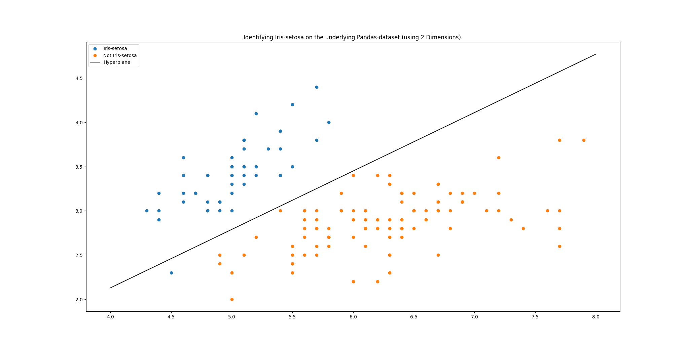

# Iris Flower Classification (LLS)


A clean, modular implementation of the **Linear Least Squares (LLS)** algorithm to classify different species of the famous **Iris Dataset**.
This project demonstrates binary classification using vectorized NumPy operations, showcasing how to separate data classes using linear hyperplanes.



## Core Features
* **Modular Architecture:** Logic separated into a reusable `classifier.py` module and a main execution script.
* **Vectorized Training:** Efficient calculation of weights using the normal equation and NumPy’s `linalg.solve`.
* **Performance Analysis:** Automated calculation of confusion matrices and accuracy metrics.
* **Visualization:** Decision boundary plotting to observe class separability.


## Tech Stack & Architecture
* **Python 3** (Object-Oriented Architecture)
* **NumPy** (Vectorized Array Operations)
* **Matplotlib** (Graph Rendering & Geometry Plotting)

```text
├── classifier.py        # Core logic: LLS training & evaluation
├── main.py              # Execution script: Data loading & plotting
└── iris_seperation.png  # Image of the calculated Hyperplane separating Iris Setosa and the others
```

## Installation & Usage
1. Clone the repository:
```bash 
git clone [https://github.com/m-podolski-projects/iris-classification-lls.git](https://github.com/m-podolski-projects/iris-classification-lls.git)
cd bonn-path-finder
```

2. Install dependencies:
```bash 
pip install numpy matplotlib pandas
```

3. Run the evaluation:
```bash 
python Main.py
```

## Observations
The project highlights the limitations of linear classifiers. While Iris-setosa is perfectly separable from the other classes, Iris-versicolor exhibits significant overlap in the feature space, demonstrating the challenge of linear separability in real-world data.